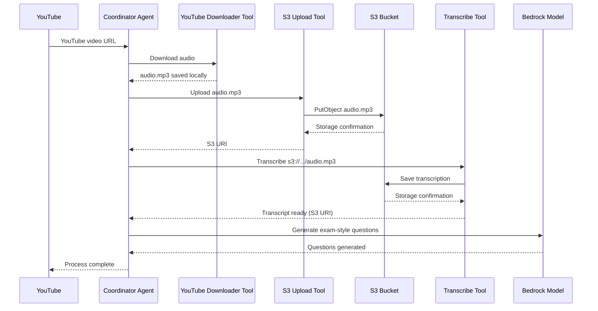

# aws-workshop-ai-agents

---

## Intro

### Eu

- Matheus Hofstede, aka "Hofs".
- Senior Software Engineer @ Didomi
- Morando em Malta a pouco tempo mais de 1 ano.
- AWS Community Builder
- Buscando a certificação AWS Associate – Solutions Architect

---

### O Plano

- Vou falar sobre agentes e como eles funcionam com AWS Strands e algums patterns
- Vamos entender algumas configurações para fazer tudo funcionar
- Vamos passar pelo código e entender como tudo funciona
- Conversar sobre a maturidade do AWS Strands

---

### Combinados

- A ideia não é fazer live coding, pra respeitar o tempo de vocês.
- Vai estar tudo gravado, então não precisa tentar reproduzir o que eu fiz.
- Literalmente esse código vai estar no github.

---

## AWS Strands

- SDK open source para criar agentes de IA.
- "Model-Driven" - Interação com LLMs e como eles interagem com serviços externos.

https://strandsagents.com/latest/

---

## Agentes?

Agentes = Prompt + Model + Tools

### Prompt

Instruções em linguagem natural a serem seguidas.

### Model

LLM, mas com possibilidade de chamar tools

### Tools

Funções que o agente pode usar para interagir, como ter acesso a internet, acesso a banco de dados, terminal ou disco.

---

## Patterns

### Tipos de patterns

- Agents as Tools
- Swarm
- Graph
- Workflow

Mas vamos focar no Agents as Tools.

---

### Agents as Tools

- Orchestrator Agent: Recebe o prompt e decide quais agentes usar para chegar no resultado.
- Tools specializados: Fazer tarefas específicas e são chamados pelo orchestrator.

Eu pessoalmente acho mais organizado porque é assim que se faz código.

https://strandsagents.com/latest/documentation/docs/user-guide/concepts/multi-agent/agents-as-tools/

---

## Configurando o AWS Strands

---

## Configurando Permissões no IAM

IAM = Identity and Access Management

### Antes de tudo, alguns conceitos

- Policies (Políticas) são documentos JSON que definem as permissões.
- Roles (Funções) identidades temporárias de usuários, serviços da AWS ou outras entidades
- Users (Usuários) são identidades permanentes que representam usuários ou aplicações que precisam acessar recursos da AWS.

Uma boa prática é usar o conceito de least privilege, ou seja, dar acesso mínimo necessário para que o usuário possa fazer o que precisa.

(falar de quais permissões são necessárias para fazer o que vamos fazer)

(falar sobre a especificidade do transcribe de ter que ter um role com acesso ao bucket)
(então vamos o agente vai passar um role para o transcribe, e logo ele precisa de permissões para isso)

### Criando policies

### Criando roles

### Criando usuários e access keys

- Crie uma policy com essas permissões:

```
{
    "Version": "2012-10-17",
    "Statement": [
        {
            "Effect": "Allow",
            "Action": [
                "bedrock:InvokeModelWithResponseStream",
                "bedrock:InvokeModel"
            ],
            "Resource": "*"
        }
    ]
}
```

- Crie um usuário com essa Policy
- Gere uma access key em Users > (usuário) > Security Credentials > Access keys >
  Command Line Interface (CLI)
- Exportar credenciais do usuário

```
export AWS_ACCESS_KEY_ID=your_access_key
export AWS_SECRET_ACCESS_KEY=your_secret_key
```

[Getting Started Oficial](https://strandsagents.com/latest/documentation/docs/user-guide/concepts/model-providers/amazon-bedrock/#getting-started)

## Como usar

```
python -m venv venv
source venv/bin/activate

pip install -r requirements.txt
python app.py
```

## Diagramas

```mermaid
architecture-beta
    group sources(cloud)[Sources]
    group agents(server)[Agents]
    group tools(functions)[Tools]
    group storage(database)[Storage]
    group providers(cloud)[Model Provider]

    service youtube(internet)[YouTube video URL] in sources

    service coordinator(server)[Coordinator Agent] in agents

    service yt_dl(functions)[YouTube Downloader Tool] in tools
    service s3_uploader(functions)[S3 Upload Tool] in tools
    service transcriber(functions)[Transcribe Tool] in tools

    service s3_bucket(disk)[S3 Bucket] in storage

    service bedrock(cloud)[Amazon Bedrock Model] in providers

    youtube:R --> L:coordinator
    coordinator:R --> L:yt_dl
    yt_dl:R --> L:s3_uploader
    s3_uploader:R --> L:s3_bucket
    coordinator:R --> L:transcriber
    transcriber:R --> L:s3_bucket
    coordinator:R --> L:bedrock
```





Links úteis:

- [Agents as Tools](https://strandsagents.com/latest/documentation/docs/user-guide/concepts/multi-agent/agents-as-tools/)
- [Strands Agents](https://strandsagents.com/latest/)
- [Introducing Strands Agents](https://aws.amazon.com/blogs/opensource/introducing-strands-agents-an-open-source-ai-agents-sdk/)
