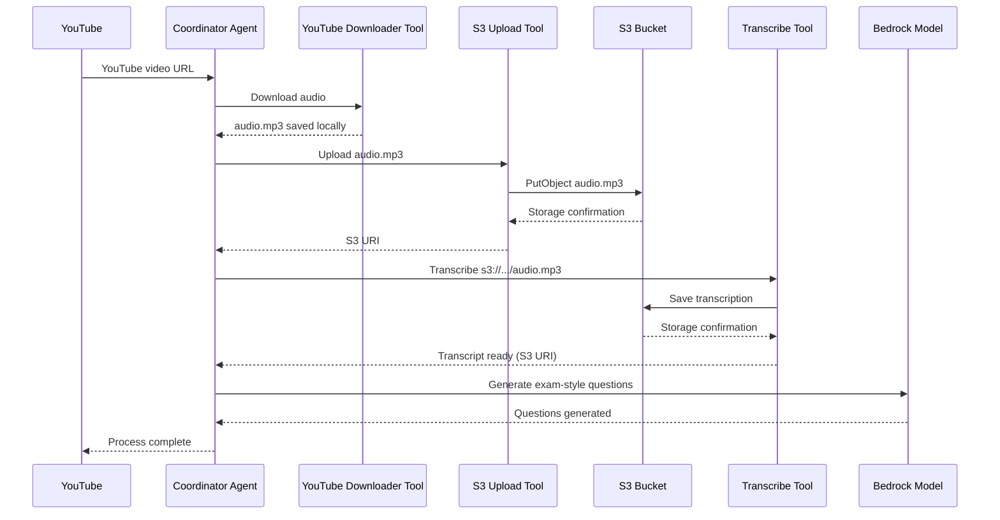

# aws-workshop-ai-agents

## Configurar AWS

- Crie uma policy com essas permissões:

```
{
    "Version": "2012-10-17",
    "Statement": [
        {
            "Effect": "Allow",
            "Action": [
                "bedrock:InvokeModelWithResponseStream",
                "bedrock:InvokeModel"
            ],
            "Resource": "*"
        }
    ]
}
```

- Crie um usuário com essa Policy
- Gere uma access key em Users > (usuário) > Security Credentials > Access keys >
  Command Line Interface (CLI)
- Exportar credenciais do usuário

```
export AWS_ACCESS_KEY_ID=your_access_key
export AWS_SECRET_ACCESS_KEY=your_secret_key
```

[Getting Started Oficial](https://strandsagents.com/latest/documentation/docs/user-guide/concepts/model-providers/amazon-bedrock/#getting-started)

## Como usar

```
python -m venv venv
source venv/bin/activate

pip install -r requirements.txt
python app.py
```

## Diagramas

```mermaid
architecture-beta
    group sources(cloud)[Sources]
    group agents(server)[Agents]
    group tools(functions)[Tools]
    group storage(database)[Storage]
    group providers(cloud)[Model Provider]

    service youtube(internet)[YouTube video URL] in sources

    service coordinator(server)[Coordinator Agent] in agents

    service yt_dl(functions)[YouTube Downloader Tool] in tools
    service s3_uploader(functions)[S3 Upload Tool] in tools
    service transcriber(functions)[Transcribe Tool] in tools
    service aws_context(functions)[AWS Context Tool] in tools

    service s3_bucket(disk)[S3 Bucket] in storage

    service bedrock(cloud)[Amazon Bedrock Model] in providers

    youtube:R --> L:coordinator
    coordinator:R --> L:yt_dl
    yt_dl:R --> L:s3_uploader
    s3_uploader:R --> L:s3_bucket
    coordinator:R --> L:transcriber
    transcriber:R --> L:s3_bucket
    coordinator:R --> L:aws_context
    coordinator:R --> L:bedrock
```





Links úteis:

- [Agents as Tools](https://strandsagents.com/latest/documentation/docs/user-guide/concepts/multi-agent/agents-as-tools/)
