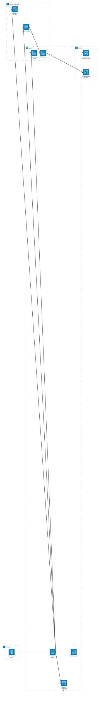
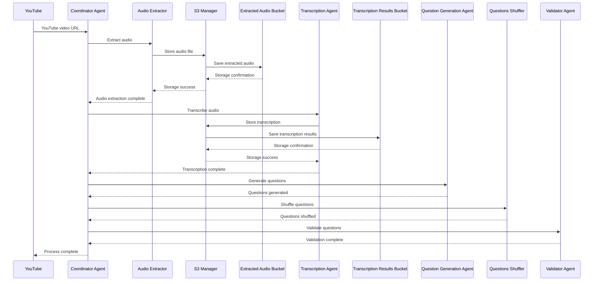

# aws-workshop-ai-agents

## Diagramas de fluxo

```mermaid
architecture-beta
    group sources(cloud)[Sources]
    group agents(server)[Agents]
    group storage(database)[Storage]
    group lambda(functions)[Lambda and Tools]

    service youtube(internet)[YouTube video URL] in sources

    service coordinator(server)[Coordinator Agent] in agents
    service transcription(server)[Transcription Agent] in agents
    service question_generator(server)[Question Generation Agent] in agents
    service validator(server)[Validator Agent] in agents

    service audio_extractor(server)[Audio Extractor] in lambda
    service questions_shuffler(server)[Questions Shuffler] in lambda
    service s3_manager(server)[S3 Manager] in lambda
    
    service extracted_audio_bucket(disk)[Extracted Audio Bucket] in storage
    service transcription_results_bucket(disk)[Transcription Results Bucket] in storage

    youtube:R --> L:coordinator
    coordinator:R --> L:audio_extractor
    audio_extractor:R --> L:s3_manager
    s3_manager:R --> L:extracted_audio_bucket
    coordinator:R --> L:transcription
    transcription:R --> L:s3_manager
    s3_manager:R --> L:transcription_results_bucket
    coordinator:R --> L:question_generator
    coordinator:R --> L:questions_shuffler
    coordinator:R --> L:validator
```

```mermaid
sequenceDiagram
    participant YT as YouTube
    participant C as Coordinator Agent
    participant AE as Audio Extractor
    participant SM as S3 Manager
    participant EAB as Extracted Audio Bucket
    participant T as Transcription Agent
    participant TRB as Transcription Results Bucket
    participant QG as Question Generation Agent
    participant QS as Questions Shuffler
    participant V as Validator Agent

    YT->>C: YouTube video URL
    
    C->>AE: Extract audio
    AE->>SM: Store audio file
    SM->>EAB: Save extracted audio
    EAB-->>SM: Storage confirmation
    SM-->>AE: Storage success
    AE-->>C: Audio extraction complete
    
    C->>T: Transcribe audio
    T->>SM: Store transcription
    SM->>TRB: Save transcription results
    TRB-->>SM: Storage confirmation
    SM-->>T: Storage success
    T-->>C: Transcription complete
    
    C->>QG: Generate questions
    QG-->>C: Questions generated
    
    C->>QS: Shuffle questions
    QS-->>C: Questions shuffled
    
    C->>V: Validate questions
    V-->>C: Validation complete
    
    C-->>YT: Process complete
```
