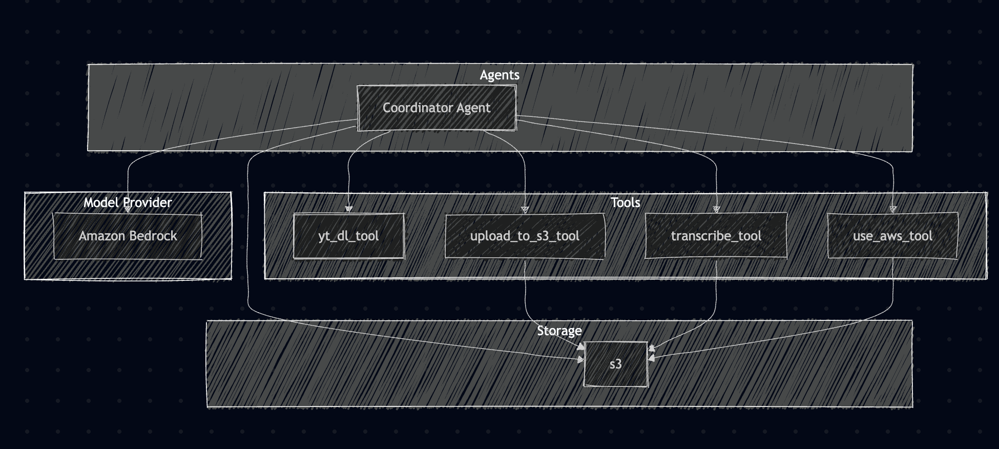

# aws-workshop-ai-agents

---

## Intro

### Eu

- Matheus Hofstede, aka "Hofs".
- Senior Software Engineer @ Didomi
- Morando em Malta a pouco tempo mais de 1 ano.
- AWS Community Builder
- Buscando a certificação AWS Associate – Solutions Architect

---

### O Plano

- Vou falar sobre agentes e como eles funcionam com AWS Strands e algums patterns
- Vamos entender algumas configurações para fazer tudo funcionar
- Vamos passar pelo código e entender como tudo funciona
- Conversar sobre a maturidade do AWS Strands

---

### Combinados

- A ideia não é fazer live coding, pra respeitar o tempo de vocês.
- Vai estar tudo gravado, então não precisa tentar reproduzir o que eu fiz.
- Literalmente esse código vai estar no github.

---

## AWS Strands

- SDK open source para criar agentes de IA.
- "Model-Driven" - Interação com LLMs e como eles interagem com serviços externos.

https://strandsagents.com/latest/

---

## Agentes?

Agentes = Prompt + Model + Tools

### Prompt

Instruções em linguagem natural a serem seguidas.

### Model

LLM, mas com possibilidade de chamar tools

### Tools

Funções que o agente pode usar para interagir, como ter acesso a internet, acesso a banco de dados, terminal ou disco.

---

## Patterns

### Tipos de patterns

- [Agents as Tools](https://strandsagents.com/latest/documentation/docs/user-guide/concepts/multi-agent/agents-as-tools/)
- [Swarm](https://strandsagents.com/latest/documentation/docs/user-guide/concepts/multi-agent/swarm/)
- [Graph](https://strandsagents.com/latest/documentation/docs/user-guide/concepts/multi-agent/graph/)

Mas vamos focar no Agents as Tools.

---

### Agents as Tools

- Orchestrator Agent: Recebe o prompt e decide quais agentes usar para chegar no resultado.
- Tools specializados: Fazer tarefas específicas e são chamados pelo orchestrator. Essas tools podem ser outros agentes.

Eu pessoalmente acho mais organizado porque é assim que se faz código.

---

## Configurando o AWS Strands

---

## Configurando Permissões no IAM

IAM = Identity and Access Management

### Antes de tudo, alguns conceitos

- Policies (Políticas) são documentos JSON que definem as permissões. Podem ser AWS Managed ou Custom Managed.
- Roles (Funções) identidades temporárias de usuários, serviços da AWS ou outras entidades
- Users (Usuários) são identidades permanentes que representam usuários ou aplicações que precisam acessar recursos da AWS.

Uma boa prática é usar o conceito de least privilege, ou seja, dar acesso mínimo necessário para que o usuário possa fazer o que precisa.

---

### Permissões necessárias

---



---


---

- Coordinator Agent -> Bedrock
- upload_to_s3_tool -> S3
- transcribe_tool -> S3 \*
- Coordinator Agent -> S3

---

- Em quase todos os casos, o agente precisa de permissões para acessar o S3.
- Mas no caso do transcribe, o agente só cria um job e espera o resultado. Logo, é o transcribe que precisa de permissões para acessar o S3 através de um role "passado".

[Documentação do Transcribe (Data input and output)](https://docs.aws.amazon.com/transcribe/latest/dg/how-input.html#how-output)

---

### Criando policies

`bedrock_agent_read`

```
{
    "Version": "2012-10-17",
    "Statement": [
        {
            "Sid": "VisualEditor0",
            "Effect": "Allow",
            "Action": [
                "bedrock:InvokeModel",
                "bedrock:InvokeModelWithResponseStream"
            ],
            "Resource": "*"
        }
    ]
}
```

---

`s3_hofs-ugs-aws-agents-audio-ireland_agent`

```
{
    "Version": "2012-10-17",
    "Statement": [
        {
            "Effect": "Allow",
            "Action": [
                "s3:PutObject",
                "s3:PutObjectAcl",
                "s3:GetObject",
                "s3:ListBucket"
            ],
            "Resource": [
                "arn:aws:s3:::hofs-ugs-aws-agents-audio-ireland",
                "arn:aws:s3:::hofs-ugs-aws-agents-audio-ireland/*"
            ]
        }
    ]
}

```

---

`transcribe_agent`

```
{
    "Version": "2012-10-17",
    "Statement": [
        {
            "Sid": "VisualEditor0",
            "Effect": "Allow",
            "Action": [
                "transcribe:StartTranscriptionJob",
                "transcribe:GetTranscriptionJob"
            ],
            "Resource": "*"
        }
    ]
}
```

---

### Criando roles

Associar a policy `s3_hofs-ugs-aws-agents-audio-ireland_agent`

`role_hofs-ugs-aws-agents-audio-ireland_rw` (Trust Relationships)

```
{
    "Version": "2012-10-17",
    "Statement": [
        {
            "Effect": "Allow",
            "Principal": {
                "Service": "transcribe.amazonaws.com"
            },
            "Action": "sts:AssumeRole"
        }
    ]
}

```

---

`iam_pass_role`

```
{
    "Version": "2012-10-17",
    "Statement": [
        {
            "Sid": "VisualEditor0",
            "Effect": "Allow",
            "Action": "iam:PassRole",
            "Resource": "arn:aws:iam::244294276378:role/role_hofs-ugs-aws-agents-audio-ireland_rw"
        }
    ]
}
```

---

Resumindo...

| Componente | Policy                                                                         |
| ---------- | ------------------------------------------------------------------------------ |
| Agent      | `bedrock_agent_read` (Invocação do modelo)                                     |
| Agent      | `s3_hofs-ugs-aws-agents-audio-ireland_agent` (Acesso de leitura/escrita ao S3) |
| Agent      | `transcribe_agent` (Acesso ao Transcribe)                                      |
| Agent      | `iam_pass_role` (Passar role para o Transcribe)                                |
| Transcribe | `s3_hofs-ugs-aws-agents-audio-ireland_agent` (Acesso de leitura/escrita ao S3) |

---

### Criando usuários e access keys

- Criar um usuário com essas policies
- Gere uma access key em Users > (usuário) > Security Credentials > Access keys > Command Line Interface (CLI)
- Exportar credenciais do usuário

```
export AWS_ACCESS_KEY_ID=your_access_key
export AWS_SECRET_ACCESS_KEY=your_secret_key
```

[Getting Started Oficial (Usando somente o Bedrock)](https://strandsagents.com/latest/documentation/docs/user-guide/concepts/model-providers/amazon-bedrock/#getting-started)

---

## Finalmente, pra aplicação

---

```
python -m venv venv
source venv/bin/activate

pip install -r requirements.txt
python app.py
```

## Diagramas


Links úteis:

- [Agents as Tools](https://strandsagents.com/latest/documentation/docs/user-guide/concepts/multi-agent/agents-as-tools/)
- [Strands Agents](https://strandsagents.com/latest/)
- [Introducing Strands Agents](https://aws.amazon.com/blogs/opensource/introducing-strands-agents-an-open-source-ai-agents-sdk/)
